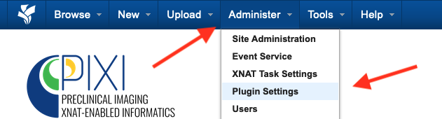

Administration
==============

Plugin Settings
---------------

Plugin settings for the PIXI plugin or any other XNAT plugin can be modified by administrators.
From any view, select Administer -> Plugin Settings in the menu bar.
Plugins will be listed vertically on the left side of the display.
Please see instructions below for various configuration settings.

--------------------------
Site Plugin Settings
--------------------------

**Subject Settings**

Subject settings include:

- Subject Display Preferences
- Species
- Animal Vendors / Suppliers

Select Subject settings under PIXI in the Plugin Setting column of the display.

.. image:: ./pixi_subject_settings.png
 :align: center

*Subject Display:*
XNAT was originally designed to collect data for human subjects.
The PIXI plugin adds a data type for Animal Demographic Data,
and you will want to select a default type of demographic data for your installation.
Select the Demographic Data Type (xnat:demographicData, pixi:animalDemographicData) that will be most common.
This will set a preference on a site-wide basis.
You can override the choice for individual projects, allowing your installation to support animal subjects
in some projects and human subjects in others.

The second preference for Subject Display controls the display for human search fields for PIXI installations.
The is disabled by default, but can be enabled with this control.

*Species:*
Data entry forms includes animal species information.
The PIXI plugin supports an ontology of defined terms for species that will appear in menu items for user selection.
The administrator can create, update and delete terms through this setting.
Users will be able to user other terms for species when entering data, but these terms are not automatically added to the ontology.

*Animal Vendors / Suppliers:*
This is similar to the preference for species.
The administrator can enter a known list of suppliers in this preference setting.
XNAT will provide these as menu items at the point of data entry to support consistent terminology.
As with species, a user will be able to enter a different value, but that value will not be automatically added to this list.

**PDX and Cell Line Preferences**

Patient-Derived Xenograft (PDX) information is maintained by PIXI as a site-wide resource.
That allows the PDX information to be entered once and reused/referenced in a single project and across multiple projects.
You can manage the set of PDXs as an administrator.
Cell lines are managed globally in the same way.

As described above, enter the Plugin Settings page from the Administer menu.
Select *PDXs and Cell Lines* under Plugin Settings (PIXI) in the left flap.
You can create, update or delete a PDX enter or a Cell Line entry when the administration page is rendered.
You can provide a web link for both types of entities to refer to documentation provided by the PDX or Cell Line provider.

.. image:: ./pdx_cell-line_administration.png
 :align: center

--------------------------
Hotel splitter configuration
--------------------------

------------------------------------
Experiments for Small Animal Imaging
------------------------------------

--------------
Project Settings
--------------

--------
Searches
--------

