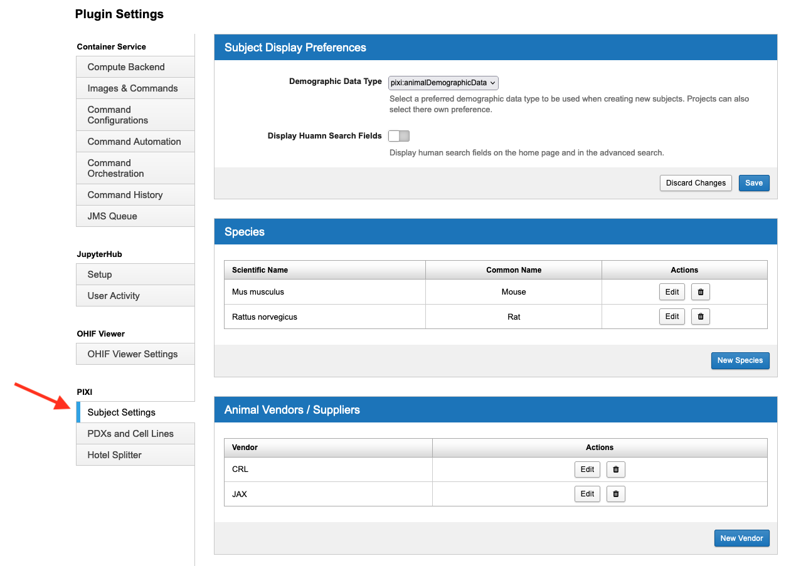
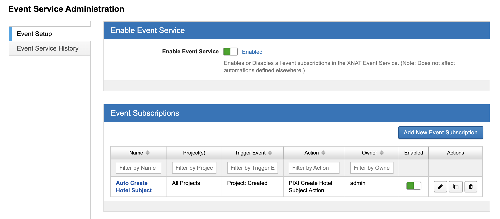
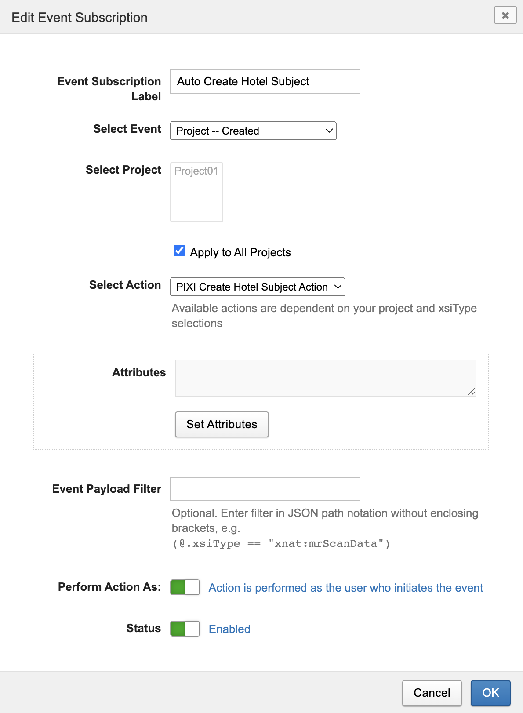
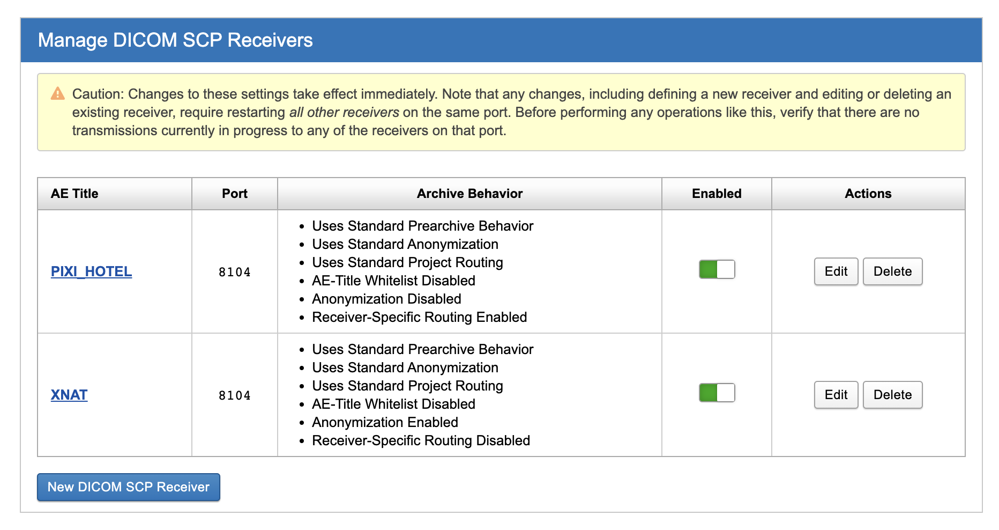
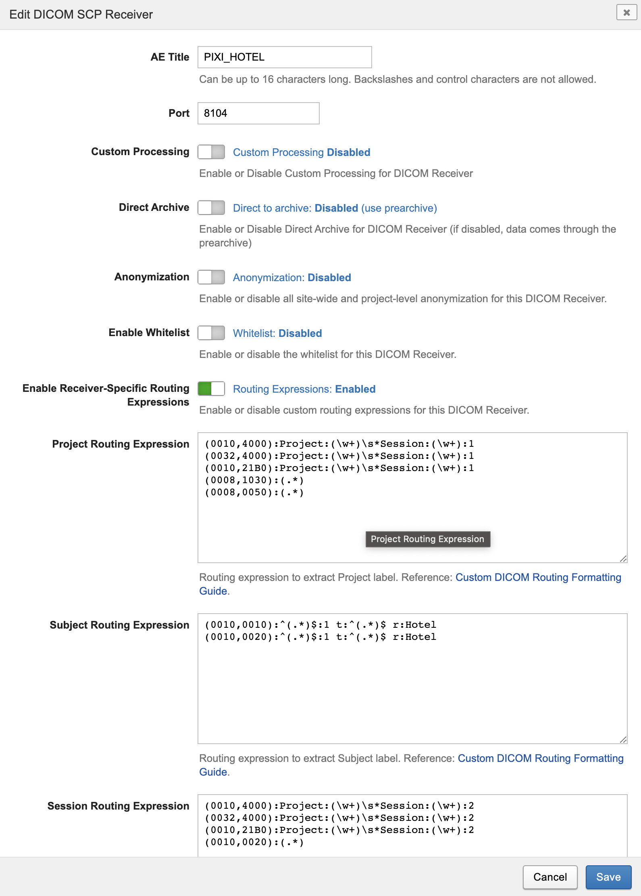

Administration
==============

Site Settings
-------------

Plugin settings for the PIXI plugin or any other XNAT plugin can be modified by administrators.
From any view, select Administer -> Plugin Settings in the menu bar.
Plugins will be listed vertically on the left side of the display.
Please see instructions below for various configuration settings.

.. image:: ./images/plugin_settings.png
 :align: center

----------------
Subject Settings
----------------

Subject settings include:

- Subject Display Preferences
- Species
- Animal Vendors / Suppliers
- Animal Endpoints

Select Subject settings under PIXI in the Plugin Setting column of the display.

*Subject Display:*
XNAT was originally designed to collect data for human subjects.
The PIXI plugin adds a data type for Animal Demographic Data,
and you will want to select a default type of demographic data for your installation.
Select the Demographic Data Type (xnat:demographicData, pixi:animalDemographicData) that will be most common.
This will set a preference on a site-wide basis.
You can override the choice for individual projects, allowing your installation to support animal subjects
in some projects and human subjects in others.

The second preference for Subject Display controls the display for human search fields for PIXI installations.
The is disabled by default, but can be enabled with this control.

*Species:*
Data entry forms includes animal species information.
The PIXI plugin supports an ontology of defined terms for species that will appear in menu items for user selection.
The administrator can create, update and delete terms through this setting.
Users will be able to user other terms for species when entering data, but these terms are not automatically added to the ontology.

*Animal Vendors / Suppliers:*
This is similar to the preference for species.
The administrator can enter a known list of suppliers in this preference setting.
XNAT will provide these as menu items at the point of data entry to support consistent terminology.
As with species, a user will be able to enter a different value, but that value will not be automatically added to this list.

*Animal Endpoints:*
Data entry forms include animal endpoint selections. The PIXI plugin supports an ontology of defined terms for endpoints
that will appear in menu items for user selection. The administrator can create, update and delete terms through this
setting.  Users will be able to user other terms for endpoints when entering data, but these terms are not automatically
added to the ontology.

-----------------------
Tumor Model Preferences
-----------------------

Patient-derived tumor and cell line model information is maintained by PIXI as a site-wide resource.
That allows the tumor model information to be entered once and reused/referenced across multiple projects.
You can manage these as an administrator by selecting Tumor Models under PIXI in the XNAT plugin settings.

----------------------------
Hotel Splitter Configuration
----------------------------

The hotel image splitter is a feature of the PIXI plugin that allows you to split multi-subject DICOM images into
single-subject DICOM images. To use the hotel image splitter, you will need to have XNAT's `Container Service <https://wiki.xnat.org/container-service/>`_
and be familiar with how to manage commands and images. You may also need to review XNAT's `Event Service <https://wiki.xnat.org/documentation/using-the-xnat-event-service>`_
documentation, as automating image splitting process relies on this service.

*'Hotel' Subject Label*

The "hotel" images for a project are stored in a special placeholder "hotel" subject, which can be created automatically
for new projects using an Event Service action, or created manually for existing or new projects. All hotel image
sessions for a project should be uploaded to a project's hotel subject. Note that if a project does not do hotel
imagining, you do not need to create a hotel subject for that project or if one exists, you can delete it.

**Automatically create hotel subject**

To automatically create a hotel subject for a project, you will need to create an Event Service action that will be
triggered when a new project is created. The action should be configured as follows:

1. Go to the Event Setup tab of the XNAT Event Service by selecting Administer --> Event Service from the top navigation bar.
2. Locate the default event subscription "Auto Create Hotel Subject" with action "PIXI Create Hotel Subject Action".
   The PIXI plugin should have created this automatically. If it is missing, you can add it by creating a new subscription.
3. Ensure that the "Project - Created" event is selected, and that the "Apply to All Projects" checkbox is checked.
4. Optionally, choose whether to perform the action as the subscription owner or the user who initiated the event.
5. Set the status of the event subscription to "Enabled".
6. Click "OK" to save the changes.

With this event subscription enabled, the 'hotel' subject will be created automatically for new projects. If you need to
create the 'hotel' subject manually for an existing project, you can do so by following the manual steps described below.

**Manually create hotel subject**

1. From the top navigation bar, select New --> Subjects --> Create a Single Subject.
2. Select the project to which you want to add the 'hotel' subject.
3. In the Subject ID field, enter "Hotel".
4. Click "Submit" to create the subject.

*Configuring a DICOM SCP Receiver for hotel image sessions*

If you do not upload images to XNAT using the DICOM SCP receiver functionality you can skip this step. If you are
unfamiliar with XNAT's DICOM receiver functionality please review the
`Connecting XNAT to DICOM Scanners and PACS <https://wiki.xnat.org/documentation/connecting-xnat-to-dicom-scanners-and-pacs>`_
and `How XNAT Scans DICOM to Map to Project/Subject/Session <https://wiki.xnat.org/documentation/how-xnat-scans-dicom-to-map-to-project-subject-ses>`_
documentation before preceding.

For hotel image sessions to route to the hotel subject via a DICOM SCP receiver we'll configure an SCP receiver to
always select the hotel subject regardless of the subject ID in the DICOM header. This receiver should only be used for
hotel image sessions.

1. From the top navigation bar, select Administer --> Site Administration.
2. Under "Advanced XNAT Settings" select "DICOM SCP Receivers".
3. Check that the "PIXI_HOTEL" Application Entity (AE) has been created and enabled. This should have been created
   automatically by the PIXI plugin. If it is missing, create a new DICOM SCP Receiver.
4. Include the word "Hotel" in the AE title to help identify this SCP receiver as being used specifically for hotel session.
5. Set the port to 8104. Note that this is the standard port that XNAT uses for DICOM SCP receivers, if your site is using
   a different port, you will need to use that port instead.
6. Enable receiver-specific routing expressions.
7. Set the Subject Routing Expression to the following:

    .. code-block:: text

        (0010,0010):^(.*)$:1 t:^(.*)$ r:Hotel
        (0010,0020):^(.*)$:1 t:^(.*)$ r:Hotel

8. The Project Routing Expression will be site and project dependent. Here's an example of a routing expression similar
   to the core XNAT routing expressions:

   .. code-block:: text

        (0010,4000):Project:(\w+)\s*Session:(\w+):1
        (0032,4000):Project:(\w+)\s*Session:(\w+):1
        (0010,21B0):Project:(\w+)\s*Session:(\w+):1
        (0008,1030):(.*)
        (0008,0050):(.*)

9. The Session Routing Expression will also be site and project dependent. Here's an example of a routing expression
   similar to the core XNAT routing expressions:

   .. code-block:: text

        (0010,4000):Project:(\w+)\s*Session:(\w+):2
        (0032,4000):Project:(\w+)\s*Session:(\w+):2
        (0010,21B0):Project:(\w+)\s*Session:(\w+):2
        (0010,0020):(.*)

10. Click "Save" to create the DICOM SCP Receiver.

*Setup the Hotel Splitter Docker Image*

Before proceeding you'll need to have XNAT's Container Service running. We will be
`Adding a Command <https://wiki.xnat.org/container-service/adding-a-command>`_ to container service.

1. Navigate to Administer --> Plugin Settings.
2. Under "Container Service" select the "Images & Commands" tab.
3. Click "New Image".
4. For the image name enter "xnat/mice-image-splitter".
5. For the version enter ":latest". For specific version tags checkout out
   `Docker Hub <https://hub.docker.com/r/xnat/mice-image-splitter/tags>`_.
6. Click "Pull Image".
7. Navigate to the "Command Configurations" tab.
8. Enable the xnat/mice-image-splitter commands.

The container commands also need to be enabled at the project level by a project owner or a site admin.

1. Navigate to a project and click the "Project Settings" link in the Actions box.
2. Click the "Configure Commands" tab.
3. Click the "Enable" toggle on all of the xnat/mice-image-splitter commands.

*Setting up Hotels*

The 'hotel' splitting is based on the `DICOM Subject Relative Position in Image <https://dicom.nema.org/medical/dicom/current/output/html/part03.html#sect_C.7.1.4.1.1.1>`_
tag. PIXI includes some common hotel configurations. If you need to add a hotel with a different
configuration you can do so by following the steps below.

1. Navigate to Administer --> Plugin Settings.
2. Under "PIXI" select the "Hotel Splitter" tab.
3. Click "New Hotel".
4. Enter a name for the hotel.
5. Enter the X and Y relative position for each subject in the hotel. Add a description for each position (e.g. "Top Left").
   Note that Z is always set to 1, splitting is currently only done in the X and Y dimensions.
6. Click "Save".

---------------
Image Importers
---------------

The Inveon image importer is a feature of the PIXI plugin that allows you to import native Inveon PET/CT images into
XNAT. To use the Inveon image importer, click the enable toggle and then click "Save" to save the changes. The Inveon
image importer will be available in the Upload navigation menu when enabled.

Project Settings
----------------

----------------
Subject Settings
----------------

**Subject Display Preferences**
The subject display preferences can be set at the project level to override the site-wide preferences. This allows
you to have some projects that use clinical subject display preferences and others that use animal subject display. To
set the subject display preferences for a project, navigate to the project and click the "Project Settings" link in the
Actions box. Select the "Subject Settings" tab and select the desired subject display preferences (xnat:demographicData
or pixi:animalDemographicData) from the "Subject Display Preferences" dropdown. Click "Save" to save the changes.

--------------------------
Image Acquisition Contexts
--------------------------

The image acquisition context preferences are set at the project level and are used to help populate commonly repeated
fields for fasting, anesthesia, and heating conditions in the hotel scan record form.

To create a fasting, anesthesia, or heating conditions template for a project, navigate to the project and click the
"Project Settings" link in the Actions box. Select the "Subject Settings" tab and click the "Add" button for each
context type. Add a name for the template, and then add the values that will be populated in the hotel scan record form.
Click "Save" to save the changes.
