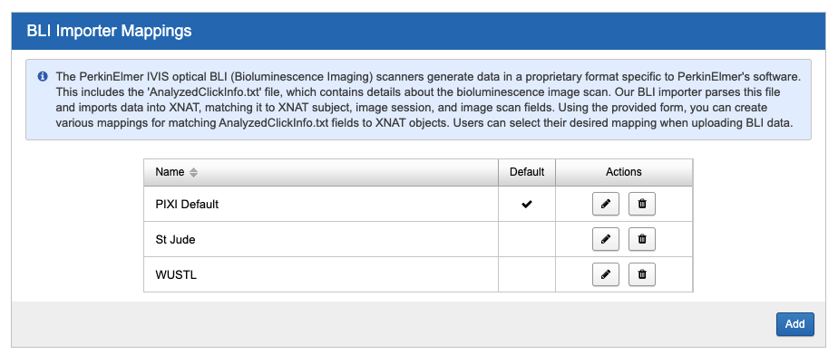
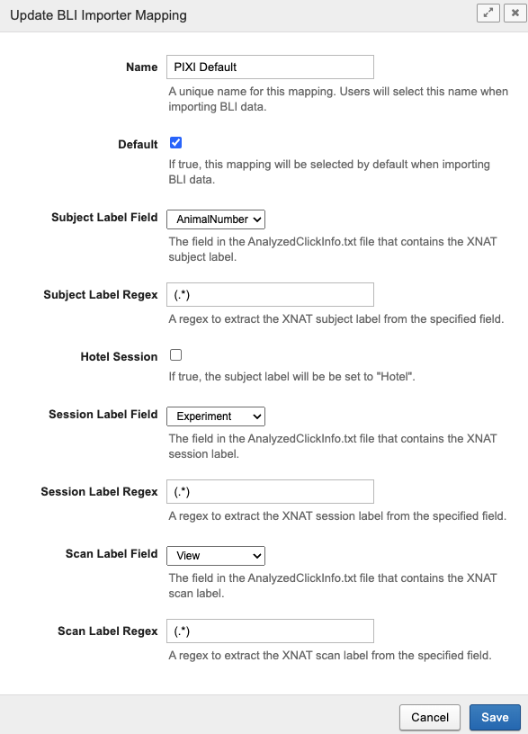

Bioluminescence Imaging
-----------------------

Bioluminescence imaging is a common modality for small animal imaging. The PIXI plugin supports this modality
by providing a new image session data type to store the data.

XNAT does not provide a mechanism to upload these image sessions, so PIXI provides a new upload mechanism. To access the
upload page, select Upload -> Bioluminescence Imaging from the navigation menu.

File Format Requirements
~~~~~~~~~~~~~~~~~~~~~~~~

The PIXI BLI importer is designed to import data from IVIS Imaging Systems. The IVIS system produces a directory
of imaging and non-imaging files. The directory generally contains the following files:

- AnalyzedClickInfo.txt (required)
- ClickInfo.txt
- background.tif
- luminescent.tif
- photograph.tif
- readbias.tif

Other files may be present and will be uploaded to XNAT. AnalyzedClickInfo.txt is required and contains the metadata
that will be stored in the XNAT database.

Importer Mappings
~~~~~~~~~~~~~~~~~

The importer can be configured to map fields from the AnalyzedClickInfo.txt file to XNAT fields as different sites
may use different fields in the AnalyzedClickInfo.txt file. Users can select the mapping to use when uploading a BLI
session. To configure the importer mappings, navigate to the Administer -> Plugin Settings -> PIXI -> BLI Importer page.

A default mapping is created when the plugin is installed. You can edit the default mapping or create a new mapping.

The XNAT project is selected by the user when uploading a BLI session. A subject, session, and scan label must be
specified in the mapping. For each XNAT field, select the corresponding field in the AnalyzedClickInfo.txt file and supply
a regular expression to extract the value from the AnalyzedClickInfo.txt file. The regular expression must contain a
single capture group. The value extracted from the capture group will be stored in the XNAT field.

If you are imaging multiple subjects in a single session, select the Hotel Session checkbox. The importer will route
the data to a projects 'Hotel' subject.

An example of the default mapping is shown below.

.. code-block:: text
    :caption: AnalyzedClickInfo.txt - Only the ClickNumber and User Label Name Set section is used by for mapping.

    *** ClickNumber:	NF20210326101714
    ClickInfoType:	SingleClickAnalysis
    .
    .
    .
    *** User Label Name Set:	Living Image Universal
    User: nf
    Group: MM1S
    Experiment:	Brain Tumor
    Comment1:
    Comment2:
    Time Point: 10m post
    Animal Number: M1
    Animal Strain:
    Animal Model:
    Sex:
    View: prone
    Cell Line:
    Reporter:
    Treatment:
    Luc Injection Time:
    IACUC Number:
    .
    .
    .

+------------+-----------------------------+--------------------+-----------------+
| XNAT Field | AnalyzedClickInfo.txt Field | Regular Expression | Extracted Value |
+============+=============================+====================+=================+
| Subject ID | Animal Number               | (.*)               | M1              |
+------------+-----------------------------+--------------------+-----------------+
| Session ID | Experiment                  | (.*)               | Brain Tumor     |
+------------+-----------------------------+--------------------+-----------------+
| Scan Label | View                        | (.*)               | prone           |
+------------+-----------------------------+--------------------+-----------------+

