User Instructions
=================

Using XNAT
------------
The `XNAT platform`_ provides a rich environment for managing imaging data with reporting, container-based processing and modular extensibility.
The PIXI plugin is one example of extending XNAT for a new purpose.
PIXI users should read and understand `How To Use XNAT`_ for baseline information.
The information provided below will describe functions that are specific to PIXI.

Batch Data Entry
----------------

Core XNAT provides forms that allow the user to enter data for various items managed by XNAT and the PIXI plugin.
PIXI adds a new capability where many of the data types managed by PIXI can be created or modified using a spreadsheet model and web user interface.
Core XNAT normally provides a form that operates on one item (e.g., subject) at a time.
Because many experiments in small animal imaging involve multiple subjects imaged or otherwise processed at the same time,
the PIXI plugin will allow the user to enter data in batch mode in a spreadsheet.

As with core XNAT, the PIXI system will extract metadata from DICOM files and store those directly in the XNAT database.
Mentioning data entry does not imply that users will re-enter acquisition and other metadata found in a DICOM image.
PIXI maintains the automated data extract from DICOM images into the XNAT database.

Small Animal Subject Model
--------------------------

PIXI includes a new data type to support attributes for small animal imaging that are not present in the human model in core XNAT.
Details of this and other data types are found in `Data Models <pixi_data_model.html>`_.

PIXI and core XNAT support three mechanisms for creating research subjects in the database:

- User creates subjects in the web UI
- XNAT accepts DICOM files and creates subjects per data in the DICOM files (assuming subjects do not already exist)
- External software can invoke the XNAT REST API to create a subject.

We will discuss the first method on this page.
Select `New -> Subjects` from the main menu.

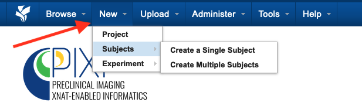

You can then select "Create a Single Subject" for the traditional web form or "Create Multiple Subjects" for batch entry.
Select "Create Multiple Subjects" to direct PIXI to the Subject Data Manager page.

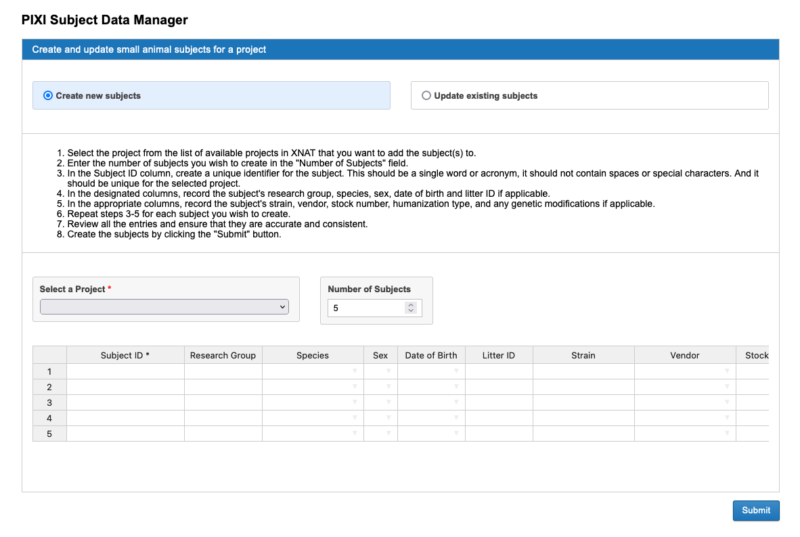

In this context, you can batch enter multiple research subjects using a spreadsheet model.

- Select the project where the subject information will be stored.
- The software defaults to a spreadsheet with 5 rows, but you can increase the number of rows.
- Scroll left and right to see all the columns that are available for data entry.

You will likely find it convenient to fill in one row and then copy/paste common data into the following rows.

*Note: You cannot copy/paste into the Subject ID row as that column requires unique values.
Copy and paste into the other cells, but enter the Subject ID information separately.*

This same page will allow you to update multiple subjects in batch mode. See the screen capture below.

.. image:: ./images/pixi_update_multiple_subjects.png
 :align: center

1. Select "Update existing subjects"
2. Select the project of interest
3. Shift-click multiple subjects
4. PIXI fills in the rows with existing values. Edit as necessary and then Submit to commit the changes.

Experiments for Small Animal Imaging
------------------------------------

XNAT and PIXI support a wide range of *experiments* that are in the data model just below subject.
`The XNAT wiki describes an experiment as follows <https://wiki.xnat.org/documentation/understanding-the-xnat-data-model>`_:

   An experiment is an event by which data is acquired.
   This data can be imaging data, or non-imaging data.
   Similar to subject, an experiment cannot exist outside the context of a project.
   It is owned by the project which first added it.
   It can additionally be shared into other projects.

Imaging sessions like CT, MR and PET are XNAT *experiments* and are strongly typed items that are managed in the XNAT database.
PIXI adds *experiment* types to XNAT and manages those as first class items in the XNAT database.
The table belows lists the experiment types that are added by the PIXI plugin.
The models for these data types are found in `Data Models <pixi_data_model.html>`_.

+---------------------------+----------------------------------------------------------------------------------------------------------------------------------------------------+
|  Type                     | Comments                                                                                                                                           |
+===========================+====================================================================================================================================================+
| Caliper Measurements      | An event in which a subject's tumor volume is measured manually using a caliper measurement tool.                                                  |
+---------------------------+----------------------------------------------------------------------------------------------------------------------------------------------------+
| Drug Therapy              | An event in which a subject is administered a drug or medication.                                                                                  |
+---------------------------+----------------------------------------------------------------------------------------------------------------------------------------------------+
| Weight                    | An event in which a subject's weight is obtained outside the context of an imaging experiment.                                                     |
+---------------------------+----------------------------------------------------------------------------------------------------------------------------------------------------+
| Cell Line                 | An event in which a cell line is injected into a small animal subject to create an animal model that can be used for preclinical research.         |
+---------------------------+----------------------------------------------------------------------------------------------------------------------------------------------------+
| Patient Derived Xenograft | An event in which human tumor tissue is engrafted into a small animal subject to create an animal model that can be used for preclinical research. |
+---------------------------+----------------------------------------------------------------------------------------------------------------------------------------------------+
| Animal Husbandry          | Record animal feeding and housing information over an interval during which conditions are relatively homogeneous.                                 |
+---------------------------+----------------------------------------------------------------------------------------------------------------------------------------------------+

DICOM Hotel Splitter
--------------------

The PIXI platform supports the standard practice of scanning multiple small animals at one time using a hotel apparatus.
We anticipate that scanner vendors have yet to implement the parts of the DICOM Standard that support hotel scans,
and PIXI includes software to split the composite images into separate images that are then organized under an
individual subject.
The workflow is mostly managed through the XNAT web user interface, but there are some configuration steps that must be
completed. See the Administration / Hotel splitter configuration page for details. There is one step to be completed at
the scanner or if the images are submitted to XNAT using the compressed uploader or XNAT Desktop Client.

1. Assign distinct labels to the individual subjects to distinguish them. This can be done before or after the imaging session.
2. Use the fixed string "Hotel" as the subject label when uploading DICOM images to XNAT.

 - The string "Hotel" can be entered at the scanner console in the field that maps to *XXXX*. Note that this is not
   needed if you've created a DICOM SCP receiver for Hotel images. But you must send the images to this hotel SCP receiver.
 - The string "Hotel" can be added to the images at a later time before the images are uploaded using the XNAT compressed uploader.
   Or the hotel subject can be selected for images already uploaded to XNAT's prearchive.
 - The string "Hotel" can be entered as the Subject ID value when the images are uploaded using the XNAT Desktop Client

3. Select the "Hotel" subject in your project. PIXI will display a page similar to the one below.
The information highlighted by the red arrow refers to the subject record and when that record was created in PIXI.

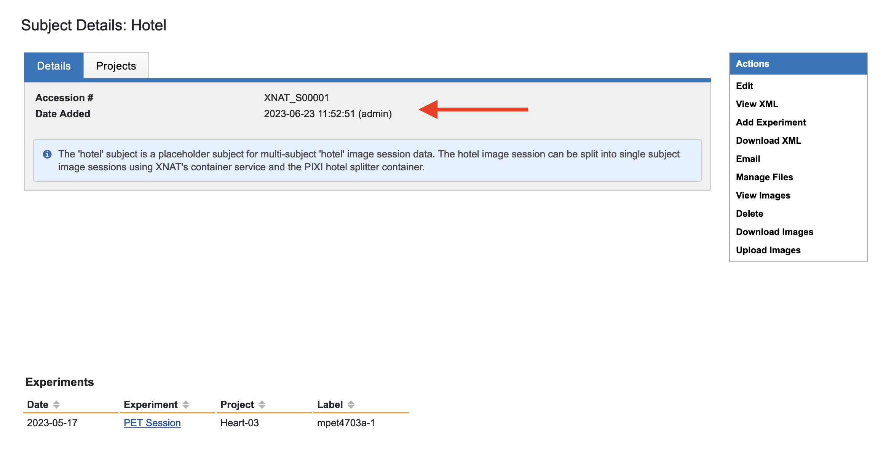

4. Select the session that was acquired for multiple subjects.
PIXI will display the Session Page with the normal Actions box.

.. image:: ./images/pixi_session_page.png
 :align: center

5. From the Session Page, select "Record New Hotel Scan" in the Actions box.
PIXI displays a page that will accept the hotel configuration (2 subjects, 3 subjects, 4 subjects, ...)
and some optional parameters.
Note: *There is an administration page to allow you to enter other hotel configurations.*

.. image:: ./images/pixi_create_hotel_scan_record.png
 :align: center

6. When you select the hotel configuration, PIXI will adjust the page and provide data entry areas for each subject.
The image below shows a partial view of the parameters that can be entered for each subject in the hotel.
The fields for Subject ID are implemented as drop-down menus.
Note: *If no items appear or you do not see the Subject ID for your subject, you will need to create that subject record and return to this page.*
Fasting, anesthesia, and heating conditions can be entered manually or by selecting a pre-defined template from the drop-down menu
(see the project settings for setting up these templates).

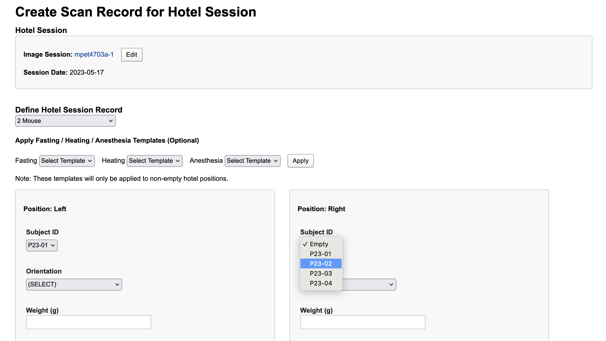

7. PIXI displays this record that is maintained in the database. You can edit values from this screen.
Return to the Session Page for this (hotel session).
PIXI shows you that a Hotel Scan Record now exists for this session
and provides a Container to run the code to split the Hotel Session and create separate sessions for the subjects selected.
In the Actions box on the Session Page, select `Run Containers -> Hotel Session Splitter`.

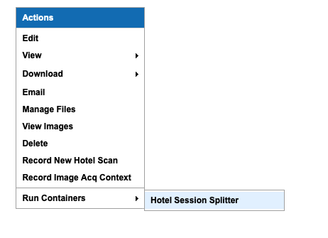

8. Container service will present a dialog with the parameters used for the hotel splitter. There is one optional input to consider – margin.
This option refers to the size of the space around identified elements within the input image that the splitter will add as a buffer to ensure it captures the entire mouse in a given split image. A larger margin will mean more buffer space given and vice versa. The default value is 4, which represents 4px for a PET image. Inputting an empty value to the margin field will cause the container to use the default value.

We believe that, in most cases, you should not need to set this value. However, if the splitter produces a set of split images that do not successfully capture the mice – for instance if the edge of a mouse is cut off – this input can be used to attempt to produce a better output upon re-running the container.
In the case that the edge of a mouse is cut off, we recommend re-running the splitter with an input margin higher than 4.
In the case that the one of the split images includes a piece of another mouse within the output image, we recommend re-running the splitter with an input margin below 4.

9. Select "Run Container" to launch the job using the container infrastructure you have deployed.

Uploading Native Inveon PET/CT Imaging Data
-------------------------------------------

To upload native Inveon PET/CT images to your XNAT, follow these steps:

1. Enable the Inveon image uploader in the XNAT plugin settings. Navigate to
   `Administer -> Plugin Settings -> PIXI tab group -> Image Importers tab`. Check the 'Enable Inveon Image Uploader'
   checkbox and save the settings. This only needs to be done once.

2. From the top menu, select `Upload -> Upload Inveon Images` to access the upload page.

3. You can upload a .zip file containing the Inveon images (.img and .img.hdr files). Note that any additional files in
   the .zip file will be ignored.

4. In the `Project & Data Selection` section, select the project to which you want to upload the data and select a .zip
   file containing the Inveon data.

5. In the `Subject & Session Identification` section, select the subject and session labeling option to use. This is
   necessary for the importer to map the Inveon data to the XNAT data model.

 - For the subject labeling option, selecting the 'Multi-Subject Image Session' option will store the session in a
   project's 'Hotel' subject. This special subject is used for storing multi-subject image sessions. Alternatively,
   you can use the subject identifier from the .img.hdr file as the subject label.

 - For the session labeling option, you can choose to use the study identifier from the .img.hdr file, the image file
   name, or the image acquisition date/time as the session label.

6. In some cases, you may need to extract a substring from a field. For example, you may want to use the first N
   characters of the file name as the session label. You can specify a regular expression to extract a substring from a
   field in the `Advanced Options` section. For instance, you would specify a regular expression like '^(.{N})' to
   extract the first N characters from the file name.

7. After selecting the project, .zip file, and labeling options, click 'Begin Upload' to start the upload process. If
   there are any issues with uploading the Inveon images to your project, the image sessions will be stored in the XNAT
   prearchive which can be accessed from the top menu by selecting `Upload -> Go to prearchive`.

Bioluminescence Imaging
-----------------------

Bioluminescence imaging is a common modality for small animal imaging. The PIXI plugin supports this modality
by providing a new image session data type to store the data.

XNAT does not provide a mechanism to upload these image sessions. PIXI provides an importer to upload IVIS bioluminescence
imaging data to XNAT. The importer reads the metadata from the AnalyzedClickInfo.txt and ClickInfo.txt files generated
by the IVIS system and uploads the data to XNAT. To access the upload page, select `Upload -> Upload BLI Images` from the
top menu.

File Format Requirements
~~~~~~~~~~~~~~~~~~~~~~~~

The BLI importer is designed to import data from IVIS Imaging Systems. The IVIS system produces a directory
of imaging and non-imaging files. The directory generally contains the following files:

- AnalyzedClickInfo.txt (required)
- ClickInfo.txt (required)
- background.tif
- luminescent.tif
- photograph.tif
- readbias.tif

Other files may be present and will be uploaded to XNAT. AnalyzedClickInfo.txt and ClickInfo.txt are required and contain
metadata about the imaging session which will be stored in the XNAT database.

Uploading IVIS Imaging Data
~~~~~~~~~~~~~~~~~~~~~~~~~~~

To upload IVIS bioluminescence imaging data to XNAT, from the top menu, select the `Upload -> Upload BLI Images` menu
item to access the upload page.

In the Project & Data Selection section, select the project to upload the data to and select a zip file containing the
IVIS data. The zip file can contain multiple IVIS directories which will be uploaded as separate image sessions.

In the Subject & Session Identification section, select the subject and session labeling option to use. The importer
needs to know how to map the IVIS data to the XNAT data model.

For the Subject Labeling option, selecting the 'Multi-Subject Image Session' option will store the session in a projects
'Hotel' subject. This special subject is used for storing multi-subject image sessions. You can also choose a field from
the AnalyzedClickInfo.txt file to use as the subject label.

For the Session Labeling option, you can choose a field from the AnalyzedClickInfo.txt file to use as the session label.
The default option will use the Image Number / Click Number field from the AnalyzedClickInfo.txt file. You can also
choose to use a field from the AnalyzedClickInfo.txt file to use as the session label.

In certain cases, the user input my need to extract a substring from a field. For example, the AnalyzedClickInfo.txt file
Comment1 field may contain a string like 'M1 Prone'. The user may want to extract the 'M1' part of the string to use as
the subject label. The user can specify a regular expression to extract a substring from a field in the Advanced Options
section. In the example, the user would specify a regular expression like '^(\w+)' to extract the first word from the
Comment1 field.

After selecting the project, zip file, and labeling options, click 'Begin Upload' to start the upload process. If there
are any issues with uploading the IVIS BLI images to your project, the image sessions will be stored in the XNAT
prearchive which can be accessed from the top menu by selecting `Upload -> Go to prearchive`.

.. _XNAT platform: https://www.xnat.org
.. _How To Use XNAT: https://wiki.xnat.org/documentation/how-to-use-xnat
.. _pixi_data_model:

Uploading Biodistribution Data
-------------------------------------------
In order to facilitate the upload of biodistribution data to an XNAT project, a dedicated biodistribution upload workflow has been created within PIXI. This workflow is currently only available to users with owner level permissions on a given project. The methodology for upload is as follows:

1. Navigate to the biodistribution upload page via the top navigation bar by clicking `Upload → Upload Biod Experiments.`

2. From this page, you will be able to use a filled CSV file to upload biodistribution information. If you do not already have a CSV template for biodistribution upload, you can download one from this page. There are two options: a simplified version which only contains columns for basic biodistribtion fields; and an advanced version which contains all possible biofistribution fields that can be uploaded to XNAT. You can use either template as the basis to build your file for upload. In step 3, we will outline the column constraints on an uploaded CSV. 

3. Opening the template – either simplified or advanced – will show you a list of columns that you may use to upload biodistribution information. We will now take a moment to outline the information found in the template and which elements are required/feature constraints that you should be aware of.

The biodistribution uploader – and by extension each of the templates – has been created to include a wide variety of fields, so that different institutions may each capture the data that they find important. Please note you *do not* need to use all, or even a majority, of the columns shown within either of the templates. Additionally, if you are starting with the basic template, you do not need to be constrained and you can add columns found in the advanced template as you see fit. However, several of the columns found within both of the templates *are* required in order to successfully upload data to XNAT. We will outline those now:

The first two required columns are inter-related: subject_id and sample_type. These two fields are used by XNAT when parsing the rows of an uploaded sheet to differentiate between biodistribution elements. Each subject is limited to one biodistribution element which may itself have several samples from different parts of the animal. In order for XNAT to be able to understand where to upload the data you have put into your sheet, both of these fields are required and must be made up of a unique pair. This concept may be difficult to explain in prose; as such, we have included the following example:

A user may have two lines within their uploaded sheet that look like this:

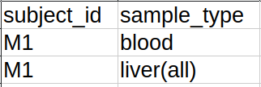

In this case, though there are two lines that include the subject id M1, each of them has a different sample type. Thus, the two lines are unique. The following two lines are also acceptable:

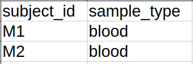

Though in this case the two sample types are the same, they are related two different subjects (and thus different biodistribution elements) and thus are also considered unique. The following, however, cannot be uploaded:

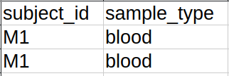

In this case, both the subject id and sample type fields are the same. This violates the uniqueness constraint and will thus cause an error during upload.

In addition to this uniqueness requirement, in order to try and ensure quality data uploads, the sample_type column has a further input constraint. As a uploader you will be limited to a specific set of acceptable values for sample_type which have been set by either the administrator of your XNAT or the owner of the project you are uploading to. Below, we show an image of the response to an upload containing an invalid input sample type:

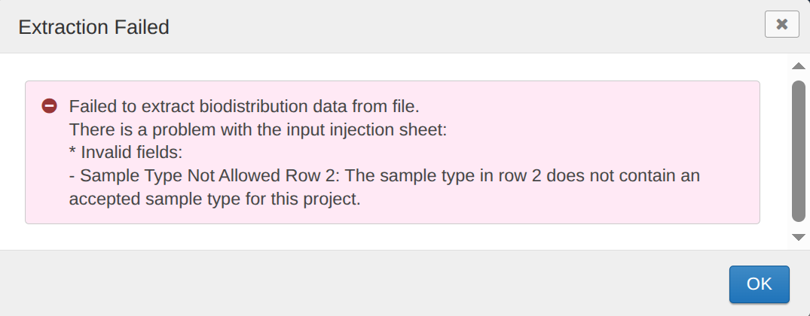

In this case, the sample type in row two is not found in the list of acceptable sample type for the project the user is attempting to upload to. In order to successfully upload the data found within the csv, the uploader must change the value for sample type in row two. If you are unsure of the list of acceptable sample types for a given project, contact the project owner or a site administrator for a complete list. If you are a project owner or site administrator and you are looking to change the list of accepted sample types for a project or site wide, please see the section below on "Changing Valid Input Sample Types."

Alongside those two interrelated fields, five other columns have been deemed essential, and thus are mandatory for successful upload: subject_group, %_id_g, tracer, experiment_datetime, and injection_datetime. The first three of these elements are encoded as strings and thus will accept whatever format of input you include. The final two fields are date/time fields and will accept a date with or without a time attached. For all fields related to dates/times – including, but not limited to the two aforementioned fields – please use the one of the date formats that has been set by your site administrator. If you are a site administrator, these date formats can be found and/or edit by going to Administration Bar → Site Administration → Appearance. Within the Standard Date Formatting subheader you will see four fields: Date Format, Time Format, Date/time Format, and Date/time/seconds Format. Any of the date formats – that is, any of these except for Time Format – may be used within any of the columns that represent dates/times. If you are not a site administrator and are unsure as to what formats have been set for your XNAT site, please contact your site administrator.

These seven fields will constitute a minimum viable sheet for upload – with each row having a value for each of these columns. Beyond these, additional columns can feature, or not feature, a value in each row. We encourage you to fill out the rest of the sheet however is applicable to your data.

4. Once you have completed the data entry for and saved your upload sheet, you can return to the biodistribution upload page. You will see the following elements which each must be completed to upload your data:

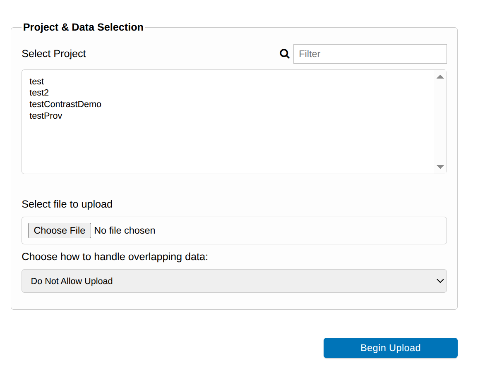

5. The first step will be to select which project you wish to upload data to. Simply click on the project you intend to upload to which will result in it being highlighted. If you have a large number of projects within your XNAT instance, you may use the filter field in the top right-hand corner to search for the specific project you are interested in.

6. Next, you will need to select the upload file you have just created in the above steps. Click the Choose File button which will bring up a new window from which you can choose the file you have saved from your local computer. Once you have selected a file, the window will close and the name of the file you have selected will be shown next to the Choose File button:

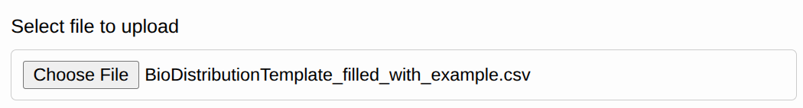

7. From here, you should turn to the “Choose how to handle overlapping data” section. This menu has three options:

- Do Not Allow Upload – This will cause an upload failure in the case that data within the sheet is already present within the project you are uploading to. It is on by default and is recommended for most users as it will ensure that no data is ever lost as a result of overlapping data.
- Upload And Skip Matching – This option will continue an upload in which there is overlapping data between the upload sheet and the project. However, it will simply skip the rows which contain overlapping data. Recommended for users that plan to have one upload sheet which they will append to as they get new data.
- Upload And Overwrite Overlapping Data – This will upload any data from within the upload sheet – regardless of if overlapping data already present within the XNAT project will be overwritten in the upload process. Recommended only for users who are certain that they will not accidentally cause data loss in the overwrite process. 

8. Once you have completed and reviewed the above fields, click the “Begin Upload” button. Which will start the process of uploading data to XNAT.

9. Upon beginning the upload process, XNAT will check to see if any of the subjects found within the subject_id column of the uploaded file are not present in the project to which you are uploading. If there are any subjects that will need to be created in order to facilitate the upload of the biodistribution data, you will be shown a pop up alerting you of which subjects will be created. If you wish to proceed, click “Create”. If, for any reason, you do not want to create these subjects, you can click “Cancel” to stop the upload process.

.. image:: ./images/biod_subjects_to_be_created.png
 :align: center
 :width: 800px

10. After clicking “Create”, XNAT will begin processing the data from your biodistribution upload sheet. If your sheet is long, and thus will result in the creation of many experiments within XNAT, this process may take a while. At any point, you may navigate away from the upload page and the upload process will continue in the background. However, if you wish to see an outline of the data created by the upload, stay on the upload page until the process is completed.

11. After completion of the upload process, you will be shown an outline of the data that has been created within your project. An example of this outline can be seen below. The names of the biodistribution elements will be automatically named using the format <Subject Name>_Biod. As a subject cannot hold more than one biodistribution experiment, this nomenclature does not risk causing overlaps. If you wish to navigate to either the project page or any of the created biodistribution pages, you may do so using the links provided in the outline.

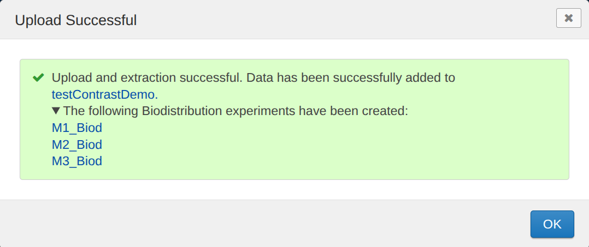

Congratulations! You have now successfully uploaded your biodistribution data to XNAT.

**Changing Valid Input Sample Types**

As noted in the above section, the accepted sample types for input within a biodistribution upload can be viewed or changed by both administrators and project owners. Administrators can set a sitewide list of acceptable sample types for an XNAT instance, which can be overridden for a specific project by a project owner setting a list of acceptable sample types for a specific project. We will outline how to perform both of these actions now.

*Administrators*

If you wish to change the accepted sample type values for your XNAT, navigate to the menu for this configuration by going to the top bar and clicking `Administer -> Plugin Settings -> Biodistribution Upload`. Here you will see a screen like the one shown below:

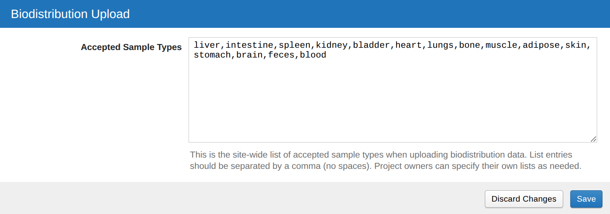

As you can see in the image, you will be shown a comma separated list of values which are allowed within the sample type column of a biodistribution sheet. In order to change the list, simply add or remove values from the list and then click "Save" to update the list. The list is comma separated and expects no spaces between values. In order to ensure that the configuration works correctly, ensure that the list follows this format when you make any changes.

*Project Owners*

If you wish for your project to deviate from the site wide configuration set by your Administrator(s), you can edit the project setting for accepted sample types. This configuration will automatically override the site wide configuration. To do so, go to the projects page and click on `Project Settings -> Biodistribution Upload`. Here, you will see a screen just like the one shown in the "Administrators" section above. Changing the list can be done just as outlined in the above section as well. Saving these changes will result in the upload system checking the project configuration rather than the site wide configuration at time of upload. As such, any changes made to the site wide configuration from this point on will not propagate to this project. For this reason, please coordinate with your XNAT administrator before making changes to this list.
