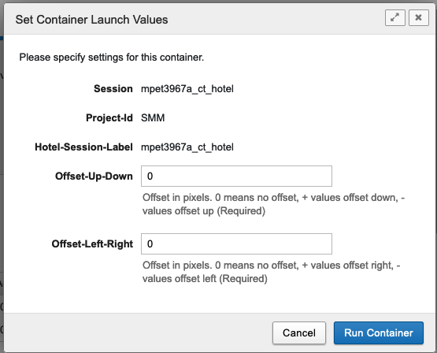

User Instructions
=================

Using XNAT
------------
The `XNAT platform`_ provides a rich environment for managing imaging data with reporting, container-based processing and modular extensibility.
The PIXI plugin is one example of extending XNAT for a new purpose.
PIXI users should read and understand `How To Use XNAT`_ for baseline information.
The information provided below will describe functions that are specific to PIXI.

Batch Data Entry
----------------

Core XNAT provides forms that allow the user to enter data for various items managed by XNAT and the PIXI plugin.
PIXI adds a new capability where many of the data types managed by PIXI can be created or modified using a spreadsheet model and web user interface.
Core XNAT normally provides a form that operates on one item (e.g., subject) at a time.
Because many experiments in small animal imaging involve multiple subjects imaged or otherwise processed at the same time,
the PIXI plugin will allow the user to enter data in batch mode in a spreadsheet.

As with core XNAT, the PIXI system will extract metadata from DICOM files and store those directly in the XNAT database.
Mentioning data entry does not imply that users will re-enter acquisition and other metadata found in a DICOM image.
PIXI maintains the automated data extract from DICOM images into the XNAT database.

Small Animal Subject Model
--------------------------

PIXI includes a new data type to support attributes for small animal imaging that are not present in the human model in core XNAT.
Details of this and other data types are found in `Data Models <pixi_data_model.html>`_.

PIXI and core XNAT support three mechanisms for creating research subjects in the database:

- User creates subjects in the web UI
- XNAT accepts DICOM files and creates subjects per data in the DICOM files (assuming subjects do not already exist)
- External software can invoke the XNAT REST API to create a subject.

We will discuss the first method on this page.
Select New -> Subjects from the main menu.

.. image:: ./images/pixi_create_subjects.png
 :align: center

You can then select "Create a Single Subject" for the traditional web form or "Create Multiple Subjects" for batch entry.
Select "Create Multiple Subjects" to direct PIXI to the Subject Data Manager page.

.. image:: ./images/pixi_subject_data_manager.png
 :align: center

In this context, you can batch enter multiple research subjects using a spreadsheet model.

- Select the project where the subject information will be stored.
- The software defaults to a spreadsheet with 5 rows, but you can increase the number of rows.

You will likely find it convenient to fill in one row and then copy/paste common data into the following rows.

*Note: You cannot copy/paste into the Subject ID row as that column requires unique values.
Copy and paste into the other cells, but enter the Subject ID information separately.*

This same page will allow you to update multiple subjects in batch mode. See the screen capture below.

.. image:: ./images/pixi_update_multiple_subjects.png
 :align: center

1. Select "Update existing subjects"
2. Select the project of interest
3. Shift-click multiple subjects
4. PIXI fills in the rows with existing values. Edit as necessary and then Submit to commit the changes.

Experiments for Small Animal Imaging
------------------------------------

XNAT and PIXI support a wide range of *experiments* that are in the data model just below subject.
`The XNAT wiki describes an experiment as follows <https://wiki.xnat.org/documentation/understanding-the-xnat-data-model>`_:

   An experiment is an event by which data is acquired.
   This data can be imaging data, or non-imaging data.
   Similar to subject, an experiment cannot exist outside the context of a project.
   It is owned by the project which first added it.
   It can additionally be shared into other projects.

Imaging sessions like CT, MR and PET are XNAT *experiments* and are strongly typed items that are managed in the XNAT database.
PIXI adds *experiment* types to XNAT and manages those as first class items in the XNAT database.
The table belows lists the experiment types that are added by the PIXI plugin.
The models for these data types are found in `Data Models <pixi_data_model.html>`_.

+---------------------------+----------------------------------------------------------------------------------------------------------------------------------------------------+
|  Type                     | Comments                                                                                                                                           |
+===========================+====================================================================================================================================================+
| Caliper Measurements      | An event in which a subject's tumor volume is measured manually using a caliper measurement tool.                                                  |
+---------------------------+----------------------------------------------------------------------------------------------------------------------------------------------------+
| Drug Therapy              | An event in which a subject is administered a drug or medication.                                                                                  |
+---------------------------+----------------------------------------------------------------------------------------------------------------------------------------------------+
| Weight                    | An event in which a subject's weight is obtained outside the context of an imaging experiment.                                                     |
+---------------------------+----------------------------------------------------------------------------------------------------------------------------------------------------+
| Cell Line                 | An event in which a cell line is injected into a small animal subject to create an animal model that can be used for preclinical research.         |
+---------------------------+----------------------------------------------------------------------------------------------------------------------------------------------------+
| Patient Derived Xenograft | An event in which human tumor tissue is engrafted into a small animal subject to create an animal model that can be used for preclinical research. |
+---------------------------+----------------------------------------------------------------------------------------------------------------------------------------------------+
| Animal Husbandry          | Record animal feeding and housing information over an interval during which conditions are relatively homogeneous.                                 |
+---------------------------+----------------------------------------------------------------------------------------------------------------------------------------------------+

DICOM Hotel Splitter
--------------------

The PIXI platform supports the standard practice of scanning multiple small animals at one time using a hotel apparatus.
We anticipate that scanner vendors have yet to implement the parts of the DICOM Standard that support hotel scans,
and PIXI includes software to split the composite images into separate images that are then organized under an
individual subject.
The workflow is mostly managed through the XNAT web user interface, but there are some configuration steps that must be
completed. See the Administration / Hotel splitter configuration page for details. There is one step to be completed at
the scanner or if the images are submitted to XNAT using the compressed uploader or XNAT Desktop Client.

1. Assign distinct labels to the individual subjects to distinguish them. This can be done before or after the imaging session.
2. Use the fixed string "Hotel" as the subject label when uploading DICOM images to XNAT.

 - The string "Hotel" can be entered at the scanner console in the field that maps to *XXXX*. Note that this is not
   needed if you've created a DICOM SCP receiver for Hotel images. But you must send the images to this hotel SCP receiver.
 - The string "Hotel" can be added to the images at a later time before the images are uploaded using the XNAT compressed uploader.
   Or the hotel subject can be selected for images already uploaded to XNAT's prearchive.
 - The string "Hotel" can be entered as the Subject ID value when the images are uploaded using the XNAT Desktop Client

3. Select the "Hotel" subject in your project. PIXI will display a page similar to the one below.
The information highlighted by the red arrow refers to the subject record and when that record was created in PIXI.

.. image:: ./images/pixi_hotel_subject.png
 :align: center

4. Select the session that was acquired for multiple subjects.
PIXI will display the Session Page with the normal Actions box.

.. image:: ./images/pixi_session_page.png
 :align: center

5. From the Session Page, select "Record New Hotel Scan" in the Actions box.
PIXI displays a page that will accept the hotel configuration (2 subjects, 3 subjects, 4 subjects, ...)
and some optional parameters.
Note: *There is an administration page to allow you to enter other hotel configurations.*

.. image:: ./images/pixi_create_hotel_scan_record.png
 :align: center

6. When you select the hotel configuration, PIXI will adjust the page and provide data entry areas for each subject.
The image below shows a partial view of the parameters that can be entered for each subject in the hotel.
The fields for Subject ID are implemented as drop-down menus.
Note: *If no items appear or you do not see the Subject ID for your subject, you will need to create that subject record and return to this page.*
Fasting, anesthesia, and heating conditions can be entered manually or by selecting a pre-defined template from the drop-down menu
(see the project settings for setting up these templates).

.. image:: ./images/pixi_detailed_hotel_scan_record.png
 :align: center

7. PIXI displays this record that is maintained in the database. You can edit values from this screen.
Return to the Session Page for this (hotel session).
PIXI shows you that a Hotel Scan Record now exists for this session
and provides a Container to run the code to split the Hotel Session and create separate sessions for the subjects selected.
In the Actions box on the Session Page, select Run Containers -> Hotel Session Splitter.

.. image:: ./images/pixi_select_hotel_splitter_container.png
 :align: center

8. PIXI will present a dialog box to allow you to adjust pixel offsets for the images
and a button to run the container that will perform this task.
When you select "Run Container", that job is launched using the Container infrastructure you have deployed.

Uploading Native Inveon PET/CT Imaging Data
-------------------------------------------

To upload native Inveon PET/CT images to your XNAT, follow these steps:

1. Enable the Inveon image uploader in the XNAT plugin settings. Navigate to
   `Administer -> Plugin Settings -> PIXI tab group -> Image Importers tab`. Check the 'Enable Inveon Image Uploader'
   checkbox and save the settings. This only needs to be done once.

2. From the top menu, select `Upload -> Upload Inveon Images` to access the upload page.

3. You can upload a .zip file containing the Inveon images (.img and .img.hdr files). Note that any additional files in
   the .zip file will be ignored.

4. In the `Project & Data Selection` section, select the project to which you want to upload the data and select a .zip
   file containing the Inveon data.

5. In the `Subject & Session Identification` section, select the subject and session labeling option to use. This is
   necessary for the importer to map the Inveon data to the XNAT data model.

 - For the subject labeling option, selecting the 'Multi-Subject Image Session' option will store the session in a
   project's 'Hotel' subject. This special subject is used for storing multi-subject image sessions. Alternatively,
   you can use the subject identifier from the .img.hdr file as the subject label.

 - For the session labeling option, you can choose to use the study identifier from the .img.hdr file, the image file
   name, or the image acquisition date/time as the session label.

6. In some cases, you may need to extract a substring from a field. For example, you may want to use the first N
   characters of the file name as the session label. You can specify a regular expression to extract a substring from a
   field in the `Advanced Options` section. For instance, you would specify a regular expression like '^(.{N})' to
   extract the first N characters from the file name.

7. After selecting the project, .zip file, and labeling options, click 'Begin Upload' to start the upload process. If
   there are any issues with uploading the Inveon images to your project, the image sessions will be stored in the XNAT
   prearchive which can be accessed from the top menu by selecting `Upload -> Go to prearchive`.

Bioluminescence Imaging
-----------------------

Bioluminescence imaging is a common modality for small animal imaging. The PIXI plugin supports this modality
by providing a new image session data type to store the data.

XNAT does not provide a mechanism to upload these image sessions. PIXI provides an importer to upload IVIS bioluminescence
imaging data to XNAT. The importer reads the metadata from the AnalyzedClickInfo.txt and ClickInfo.txt files generated
by the IVIS system and uploads the data to XNAT. To access the upload page, select Upload -> Upload BLI Images from the
top menu.

File Format Requirements
~~~~~~~~~~~~~~~~~~~~~~~~

The PIXI BLI importer is designed to import data from IVIS Imaging Systems. The IVIS system produces a directory
of imaging and non-imaging files. The directory generally contains the following files:

- AnalyzedClickInfo.txt (required)
- ClickInfo.txt (required)
- background.tif
- luminescent.tif
- photograph.tif
- readbias.tif

Other files may be present and will be uploaded to XNAT. AnalyzedClickInfo.txt and ClickInfo.txt are required and contain
metadata about the imaging session which will be stored in the XNAT database.

Uploading IVIS Imaging Data
~~~~~~~~~~~~~~~~~~~~~~~~~~~

To upload IVIS bioluminescence imaging data to XNAT, from the top menu, select the Upload -> Upload BLI Images menu
item to access the upload page.

In the Project & Data Selection section, select the project to upload the data to and select a zip file containing the
IVIS data. The zip file can contain multiple IVIS directories which will be uploaded as separate image sessions.

In the Subject & Session Identification section, select the subject and session labeling option to use. The importer
needs to know how to map the IVIS data to the XNAT data model.

For the Subject Labeling option, selecting the 'Multi-Subject Image Session' option will store the session in a projects
'Hotel' subject. This special subject is used for storing multi-subject image sessions. You can also choose a field from
the AnalyzedClickInfo.txt file to use as the subject label.

For the Session Labeling option, you can choose a field from the AnalyzedClickInfo.txt file to use as the session label.
The default option will use the Image Number / Click Number field from the AnalyzedClickInfo.txt file. You can also
choose to use a field from the AnalyzedClickInfo.txt file to use as the session label.

In certain cases, the user input my need to extract a substring from a field. For example, the AnalyzedClickInfo.txt file
Comment1 field may contain a string like 'M1 Prone'. The user may want to extract the 'M1' part of the string to use as
the subject label. The user can specify a regular expression to extract a substring from a field in the Advanced Options
section. In the example, the user would specify a regular expression like '^(\w+)' to extract the first word from the
Comment1 field. `Regex101 <https://regex101.com/>`_ is a useful tool for testing regular expressions in the browser.

.. _XNAT platform: https://www.xnat.org
.. _How To Use XNAT: https://wiki.xnat.org/documentation/how-to-use-xnat
.. _pixi_data_model:
